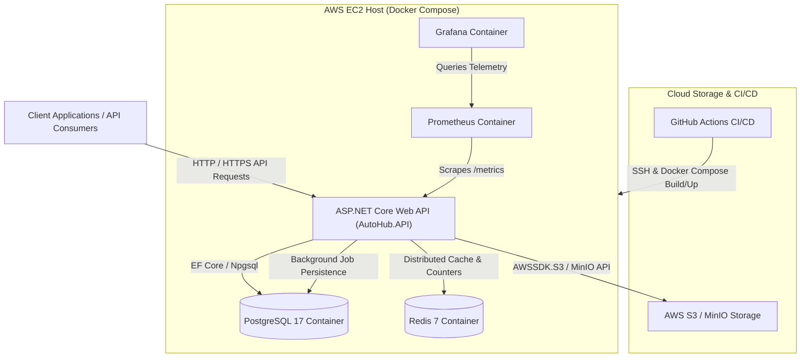

# AutoHub API - System Architecture

This document describes the architectural layout, core components, request flows, deployment strategy, and technology choices for the **AutoHub API** solution.

---

## 1. Overall Architecture Overview

The solution is built following **Clean Architecture (Onion Architecture)** principles to ensure separation of concerns, maintainability, and testability. The application logic is decoupled from external infrastructure concerns, databases, and third-party services through explicit interfaces.

### Architectural Layers

- **AutoHub.Domain**: The core layer containing domain entities (`User`, `Vehicle`, `VehicleImage`, `Reservation`, `Inquiry`, `Favourite`, `Analytics`), domain enums (`UserRole`, `VehicleStatus`, `ReservationStatus`), and core domain rules. Has zero external dependencies.
- **AutoHub.Application**: Contains application logic contracts, Data Transfer Objects (DTOs), service interfaces (`IAuthService`, `IVehicleService`, `IStorageService`, `ICacheService`, `IBackgroundJobService`), and request/response models.
- **AutoHub.Infrastructure**: Delivers concrete implementations of application interfaces including Entity Framework Core data context (`ApplicationDbcontext`), PostgreSQL persistence, Redis distributed caching, Hangfire background jobs, password hashing, and object storage providers (AWS S3 & MinIO).
- **AutoHub.API**: The entry point exposing RESTful HTTP endpoints. Configures ASP.NET Core middleware, JWT authentication, role-based authorization, rate limiting, Serilog logging, Prometheus metrics, health checks, and OpenAPI/Swagger documentation.

---

## 2. Component Responsibilities

Only components implemented within the solution are listed below:

- **ASP.NET Core Web API**: Exposes REST API endpoints, enforces authentication and rate limiting, handles HTTP request/response lifecycles, and maps client requests to application services.
- **PostgreSQL**: Primary relational database container storing users, vehicle listings, images, inquiries, reservations, favorites, and analytics. Also serves as the persistent storage engine for Hangfire.
- **Redis Cache**: In-memory data store providing distributed caching for trending vehicles and high-performance atomic counters for vehicle views, favorites, inquiries, and reservations.
- **Hangfire**: Background job orchestrator integrated within the .NET API runtime, executing scheduled background tasks (`expire-reservations`, `recalculate-trending`, `flush-analytics`) backed by PostgreSQL.
- **AWS S3 / MinIO**: Object storage providers for vehicle image files. S3 provides cloud media storage in production, while MinIO provides S3-compatible storage in local development environments.
- **Docker & Docker Compose**: Containerization platform managing API service instances, Redis, PostgreSQL, Prometheus, and Grafana containers across development (`docker-compose.local.yml`) and production (`docker-compose.prod.yml`).
- **GitHub Actions**: Automated CI/CD pipeline (`deploy.yml`) triggered on release branch pushes to build, test, connect to AWS EC2 via SSH, execute Docker Compose deployments, and verify health checks.
- **AWS EC2**: Amazon Web Services virtual server hosting the containerized production runtime managed by Docker Compose.
- **Prometheus**: Monitoring server that scrapes HTTP request duration, counter metrics, and system telemetry from the API's `/metrics` endpoint.
- **Grafana**: Observability dashboard platform connected to Prometheus to visualize real-time application metrics and performance data.

---

## 3. System Architecture Diagram



---

## 4. System Flows

### Request Flow

```
[Client] ──> [Rate Limiter / CORS Middleware] ──> [JWT Auth Middleware] ──> [Controller] ──> [Application Service] ──> [Redis / PostgreSQL]
```

1. **Ingress**: An HTTP request reaches the ASP.NET Core Web API pipeline.
2. **Middleware Pipeline**: The request passes through CORS policy check, Serilog request logging, rate limiting (`System.Threading.RateLimiting`), JWT authentication validation, and authorization verification.
3. **Controller Handling**: The request is routed to the target controller (`VehiclesController`, `ReservationController`, etc.), which validates input DTOs and calls the corresponding Application Service.
4. **Service & Cache Execution**: The service checks Redis (`ICacheService`) for cached data or updates atomic Redis interaction counters. If data is not cached, Entity Framework Core (`ApplicationDbcontext`) queries PostgreSQL.
5. **Response**: Parameterized database queries execute against PostgreSQL, and results are serialized to JSON DTOs and returned to the client. Unhandled exceptions are caught by `ExceptionMiddleware` and returned as structured JSON error responses.

### Authentication Flow

```
[Client] ──> [/api/auth/login] ──> [PasswordHasher (BCrypt)] ──> [JwtTokenGenerator] ──> [Returns JWT]
[Client] ──> [Protected Endpoint + Bearer Token] ──> [JwtBearer Handler] ──> [Role Check] ──> [Action Execution]
```

1. **Credentials Submission**: User sends login credentials to `/api/auth/login`.
2. **Verification**: `AuthService` retrieves the user entity from PostgreSQL and verifies the plain password against the stored BCrypt hash using `PasswordHasher`.
3. **Token Issuance**: `JwtTokenGenerator` constructs a signed JSON Web Token containing claims (`UserId`, `Email`, `Role`: `Buyer`, `Dealer`, or `Admin`).
4. **Request Authorization**: Subsequent API requests include the token in the `Authorization: Bearer <token>` header.
5. **Role-Based Validation**: ASP.NET Core JWT Bearer authentication validates the signature. `[Authorize(Roles = "...")]` attributes enforce role permissions before executing controller actions.

### Image Upload Flow

```
[Dealer Client] ──> [StorageController / VehiclesController] ──> [Upload Validation] ──> [IStorageService] ──> [AWS S3 / MinIO] ──> [Save Key in Postgres]
```

1. **Upload Request**: Authenticated dealer submits a `multipart/form-data` image file.
2. **Validation**: The API checks file extensions (`.jpg`, `.jpeg`, `.png`, `.webp`) and maximum file size limits.
3. **Provider Dispatch**: The call is delegated to `IStorageService`, resolving to `S3StorageService` (AWS S3) or `MinIOStorageService` based on configuration.
4. **Object Storage**: The service streams the image to the cloud S3 bucket or local MinIO bucket using `AWSSDK.S3`.
5. **Metadata Persistence**: The resulting object key/URI is saved into PostgreSQL via EF Core, and pre-signed URLs are generated for secure temporary media access.

### Deployment Flow

```
[Git Push release/*] ──> [GitHub Actions Runner] ──> [dotnet test] ──> [SSH to EC2] ──> [docker compose up -d --build] ──> [/health Check]
```

1. **CI Trigger**: Pushing code to a `release/*` branch or manually triggering `workflow_dispatch` starts the `.github/workflows/deploy.yml` workflow.
2. **Build & Test**: GitHub Actions runner restores dependencies, compiles the solution (`dotnet build`), and executes test projects (`dotnet test`).
3. **SSH Handshake**: The runner initiates an SSH session to the AWS EC2 server using `appleboy/ssh-action`.
4. **Container Orchestration**: The EC2 server pulls the updated code branch and runs `docker compose -f docker-compose.prod.yml up -d --build`, triggering multi-stage image builds for `AutoHub.API` and restarting containers.
5. **Health Verification**: The pipeline polls `https://${DOMAIN}/health` up to 10 times with 30-second delays to confirm API readiness before concluding the deployment.

### Monitoring Flow

```
[API Endpoint /metrics] <── [Prometheus Scraper (15s)] <── [Grafana Dashboards]
```

1. **Telemetry Instrumentation**: The `prometheus-net.AspNetCore` middleware collects HTTP request duration and count metrics, exposing them at `/metrics`.
2. **Prometheus Scraping**: A containerized Prometheus instance periodically pulls metrics from `/metrics` every 15 seconds per `prometheus/prometheus.yml`.
3. **Grafana Visualization**: Grafana queries Prometheus metrics data to render real-time operational performance dashboards.
4. **Health Reporting**: Native ASP.NET Core Health Checks verify PostgreSQL, Redis, and S3 status at `/health`.

---

## 5. Technology Choice Rationale

- **ASP.NET Core 10**: Selected for high-performance throughput, cross-platform support, robust middleware pipeline, built-in dependency injection, and native rate limiting capabilities.
- **PostgreSQL (Containerized)**: Chosen for ACID transactional compliance, relational schema support for inventory management, JSON capabilities, and seamless integration with Entity Framework Core and Hangfire storage.
- **AWS S3 / MinIO**: Offloads binary file storage from API application servers, offering scalable object storage and pre-signed URL capabilities. MinIO enables S3-compatible local development without cloud costs.
- **Redis**: Delivers fast in-memory caching and high-throughput atomic counter operations (`IncrementAsync`/`DecrementAsync`) for tracking vehicle metrics without overloading the primary database.
- **Hangfire**: Provides reliable, persistent background job scheduling within the .NET runtime using PostgreSQL storage, avoiding the need for dedicated external worker daemons.
- **Prometheus & Grafana**: Offers industry-standard metrics scraping and visual dashboards for real-time observability without vendor lock-in.
- **Docker & Docker Compose**: Guarantees environment consistency across development and production, simplifying multi-container deployment of API, Redis, PostgreSQL, Prometheus, and Grafana.
- **GitHub Actions**: Provides automated, repository-native CI/CD automation for testing and EC2 deployment.
