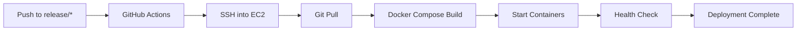

# 🚗 AutoHub

A production-ready Vehicle Marketplace built with **ASP.NET Core**, **PostgreSQL**, **Redis**, **AWS**, **Docker**, **GitHub Actions CI/CD**, **Prometheus**, **Grafana**, and **CloudWatch**.

> Designed to demonstrate modern backend architecture, cloud deployment, monitoring, and DevOps practices.


## ⭐ Key Highlights

- Production deployment on AWS EC2
- PostgreSQL hosted on Amazon RDS
- Image storage using Amazon S3
- Automated CI/CD with GitHub Actions
- HTTPS secured with Nginx and Let's Encrypt
- Background processing using Hangfire
- Redis caching
- Monitoring with CloudWatch, Prometheus & Grafana
- Health Checks and structured logging
- Dockerized development and production environments


## 🌐 Live Demo

Frontend

https://autohub-app-theta.vercel.app

Backend API

https://autohub-demo.duckdns.org

Swagger

https://autohub-demo.duckdns.org/swagger


## 📷 Screenshots

### Home


### Vehicle Details


### Swagger

(image)

### Grafana Dashboard

(image)


## Why AutoHub?

AutoHub was built to demonstrate how a production-ready backend should be designed and deployed.

Instead of focusing only on CRUD operations, the project emphasizes:

- Cloud-native deployment
- Clean Architecture
- CI/CD
- Monitoring & Observability
- Secure authentication
- Scalable infrastructure


## Features

See

docs/FEATURES.md


## Architecture

See

docs/ARCHITECTURE.md


## API Documentation

Complete API reference:

docs/API.md

Swagger:

https://autohub-demo.duckdns.org/swagger


## Folder Structure

See

docs/FOLDER_STRUCTURE.md


## 🚀 Local Setup

### Prerequisites

Before running the project, make sure you have the following installed:

- .NET SDK 10
- Docker Desktop
- PostgreSQL client (PgAdmin or DBeaver)
- Git
- Visual Studio 2022 / Visual Studio Code

---

### 1. Clone the Repository

```bash
git clone https://github.com/JindalMistry/AutoHub.git
cd AutoHub
```

---

### 2. Start Required Infrastructure

From the solution root, run:

```bash
docker compose up -d
```

This will start the required infrastructure using Docker:

- PostgreSQL
- Redis
- MinIO

Docker will also create the required persistent volumes automatically.

> **Important:** Docker Desktop must be running before starting the API. Otherwise, the application will fail to connect to its dependencies.

---

### 3. Create the Database

Open PostgreSQL using **PgAdmin** or **DBeaver** and create a new database.

Example:

```
AutoHub
```

Use this database name in your User Secrets.

---

### 4. Create the MinIO Bucket

Open the MinIO Console:

```
http://localhost:9001
```

Login using:

```
Username: minioadmin
Password: minioadmin
```

Create a bucket and use its name in your User Secrets.

Example:

```
autohub
```

---

### 5. Configure User Secrets

Initialize User Secrets:

```bash
dotnet user-secrets init
```

Configure the following values:

```json
{
  "Redis:ConnectionString": "localhost:6379",

  "Jwt:Secret": "CREATE_YOUR_SECRET",

  "Hangfire:Username": "admin",
  "Hangfire:Password": "admin123",

  "ConnectionStrings:DefaultConnection": "Host=localhost;Port=5342;Database=YOUR_DATABASE_NAME;Username=postgres;Password=postgres",

  "Storage:Provider": "MinIO",
  "Storage:BucketName": "YOUR_BUCKET_NAME",
  "Storage:Endpoint": "localhost:9000",
  "Storage:AccessKey": "minioadmin",
  "Storage:SecretKey": "minioadmin",
  "Storage:Region": "",
  "Storage:UseSSL": false
}
```

---

### 6. Run the API

Using Visual Studio:

- Set **AutoHub.API** as the startup project.
- Press **F5**.

Or using the .NET CLI:

```bash
dotnet run --project AutoHub.API
```

---

### 7. Verify Everything

After the application starts, verify the following:

| Service | URL |
|---------|-----|
| API | `https://localhost:<port>` |
| Swagger | `https://localhost:<port>/swagger` |
| Health Check | `https://localhost:<port>/health` |
| Hangfire | `https://localhost:<port>/hangfire` |
| MinIO Console | `http://localhost:9001` |


## 📊 Monitoring

AutoHub includes a production-style monitoring setup to provide visibility into infrastructure health, application performance, and operational metrics.

### CloudWatch

AWS CloudWatch is used to monitor the EC2 instance.

Monitored metrics include:

- CPU Utilization
- Memory Usage
- Disk Usage
- Disk I/O
- Network Traffic

CloudWatch Alarms can be configured to notify when resource utilization exceeds predefined thresholds.

---

### Prometheus

The API exposes a `/metrics` endpoint using **prometheus-net**.

Prometheus periodically scrapes application metrics, including:

- HTTP Requests
- Request Duration
- Request Status Codes
- ASP.NET Core Runtime Metrics
- .NET Runtime Metrics

---

### Grafana

Grafana is connected to Prometheus to visualize application metrics.

Dashboards provide real-time insights into:

- API Request Rate
- Response Times
- Error Rates
- Runtime Metrics
- Application Health

---

### Health Checks

The API exposes a health endpoint:

```
/health
```

Health checks verify the availability of critical dependencies:

- PostgreSQL
- Redis
- Object Storage (MinIO / Amazon S3)

This endpoint is also used by the deployment pipeline to verify successful deployments.


## 🚀 Continuous Integration & Deployment

The project uses **GitHub Actions** to automate deployments to AWS EC2.

### Deployment Workflow

1. A push or merge to a `release/*` branch triggers the deployment workflow.
2. GitHub Actions connects securely to the EC2 instance using SSH.
3. The workflow switches to the appropriate release branch (if required).
4. The latest source code is pulled from GitHub.
5. Docker Compose rebuilds and starts the updated containers.
6. The deployment pipeline waits for the application to start.
7. A health check is executed against the `/health` endpoint.
8. The deployment succeeds only if all health checks pass.

---

### Infrastructure

The production environment includes:

- GitHub Actions
- AWS EC2
- Docker Compose
- Nginx Reverse Proxy
- Let's Encrypt SSL
- Health Check Validation

This workflow enables zero manual deployment steps after code is merged into a release branch.



